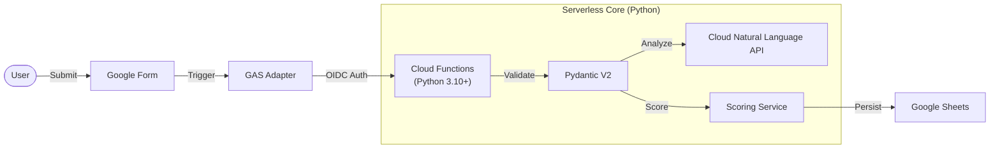

# Serverless Sentiment Analysis Pipeline (Python/GCP)


Googleフォームの回答テキストを **Google Cloud Natural Language API** を用いて感情分析し、スコアリングを行うサーバーレスパイプラインです。

従来のモノリシックなGoogle Apps Script (GAS) 運用から脱却し、**Python (Cloud Functions) によるマイクロサービスアーキテクチャ** へ移行したプロジェクトです。「責務の分離」と「型安全性」を重視した設計を採用しています。

## 🏗 Architecture

GASは「データの収集と転送」のみに責務を限定し、ビジネスロジックは全てPython環境（Cloud Functions）に集約しています。



## ✨ Key Features

* **モダンなPython設計:** `Type Hinting` と `Pydantic V2` を全面的に採用。実行時エラーを排除し、厳密なバリデーションを実現。
* **高水準なセキュリティ:**
    * **OIDC認証:** `Cloud Functions Invoker` 権限を持つGASからのみ実行可能（一般公開はブロック）。
    * **機密情報の分離:** APIキーやスプレッドシートIDは環境変数で管理し、コードベースから排除。
* **スケーラビリティ:** サーバーレス (Cloud Functions Gen2) により、リクエスト数に応じて0から自動スケール。
* **拡張性:** `Service` 層と `Adapter` 層を分離しているため、将来的なDB移行（例: Firestore, BigQuery）もコード修正を最小限に抑えて実現可能。

## 📂 Directory Structure

```text
.
├── src/
│   ├── main.py           # エントリーポイント (Controller)
│   ├── config.py         # 環境変数・設定管理
│   ├── schemas.py        # データモデル・バリデーション (Pydantic)
│   ├── services.py       # ビジネスロジック (感情分析・スコアリング)
│   └── adapters.py       # インフラ層 (Google Sheets I/O)
├── requirements.txt      # 依存ライブラリ
└── README.md
```

## 🚀 Setup & Deployment

### 1. 前提条件
* Google Cloud Platform プロジェクトの作成
* 必要なAPIの有効化: `Cloud Functions`, `Cloud Build`, `Cloud Natural Language API`, `Google Sheets API`
* `gcloud` CLI のインストール済み

### 2. 環境変数の設定
デプロイ用の環境変数ファイル `.env.yaml` を作成します（※Git管理外にすること）。

```yaml
GCP_PROJECT_ID: "your-project-id"
SHEET_ID: "your-google-sheet-id"
SHEET_NAME: "Result_Output"
```

### 3. Cloud Functions へのデプロイ
セキュリティを高めるため、`--no-allow-unauthenticated`（未認証アクセスの拒否）を設定してデプロイします。

```bash
gcloud functions deploy analyze_submission \
    --gen2 \
    --runtime=python310 \
    --region=asia-northeast1 \
    --source=. \
    --entry-point=analyze_submission \
    --trigger-http \
    --no-allow-unauthenticated \
    --env-vars-file=.env.yaml \
    --service-account=your-service-account@your-project.iam.gserviceaccount.com
```

### 4. クライアント側 (Google Apps Script) の設定
Googleフォーム側のGAS (`Code.gs`) に、OIDCトークンを含めてリクエストを送信する処理を実装します。
※ GASプロジェクトの設定ファイル `appsscript.json` にて、GCPプロジェクト番号との紐付けが必要です。

## 🔌 API Specification

**Endpoint:** `POST /analyze_submission`

### Request (JSON)
```json
{
  "timestamp": "2023-12-01T10:00:00",
  "name": "山田 太郎",
  "answers": [
    "貴社のビジョンに強く共感しており、即戦力として貢献したいと考えています。",
    "リーダーシップを発揮した経験があります。"
  ]
}
```

### Response (JSON)
```json
{
  "status": "success",
  "score": 12.5
}
```

## 🛠 Tech Stack

* **Runtime:** Python 3.10+
* **Framework:** Google Cloud Functions Framework
* **Validation:** Pydantic V2
* **Cloud Services:**
    * Google Cloud Natural Language API (Sentiment Analysis)
    * Google Sheets API (via `gspread`)
* **Client:** Google Apps Script (UrlFetchApp)

## 📜 License

This project is licensed under the MIT License.
