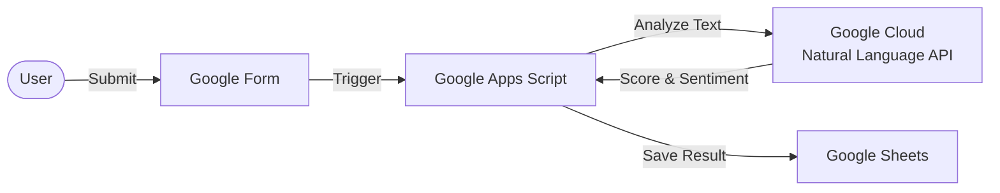

# Google Form Sentiment Analysis with GAS

Googleフォームの回答（自由記述テキスト）を**Google Natural Language API**を用いて自動で感情分析し、ポジティブ/ネガティブな傾向をスコアリングしてスプレッドシートに蓄積するGoogle Apps Scriptです。

書類選考の一次スクリーニング補助や、顧客アンケートの感情分析などを自動化するために設計されています。


## 🏗 Architecture



## ✨ Features

* **自動感情分析:** フォーム送信と同時にAPIを叩き、テキストの感情スコア（-1.0 〜 1.0）を取得。
* **キーワード補正:** 特定のキーワード（「貢献」「不安」など）が含まれる場合、スコアに加点/減点を行うロジックを実装。
* **セキュアな設計:** APIキーをコードにハードコーディングせず、Script Propertiesで管理。
* **柔軟な設定:** 分析対象の列や評価キーワードを `CONFIG` オブジェクトで一元管理。

## ⚙️ Prerequisites

1.  **Google Cloud Platform (GCP) プロジェクト**
    * [Cloud Natural Language API](https://cloud.google.com/natural-language) の有効化。
    * APIキーの取得。
2.  **Google Forms & Google Sheets**
    * フォームと、回答が紐付いたスプレッドシート。

## 🚀 Setup

### 1. スクリプトの導入
1. 対象のスプレッドシートを開き、メニューから **拡張機能 > Apps Script** を選択。
2. `Code.gs` に、本リポジトリのコードを貼り付けます。

### 2. APIキーの設定 (重要)
セキュリティのため、APIキーはコードに直接書かず、スクリプトプロパティに保存します。

1. GASエディタの左側メニュー「プロジェクトの設定 (歯車アイコン)」をクリック。
2. 下部の「スクリプト プロパティ」で **スクリプト プロパティを追加** をクリック。
3. 以下の通り設定して保存します。
    * **プロパティ:** `GCP_API_KEY`
    * **値:** `取得したGCPのAPIキー`

### 3. コンフィグ設定
コード内の `CONFIG` オブジェクトを、実際のフォームに合わせて修正します。

```javascript
const CONFIG = {
  FORM: {
    // 解析したい列番号 (A列=0, B列=1...)
    TARGET_COLUMN_INDICES: [6, 7, 8], 
    // ...
  },
  // ...
};
```

### 4. トリガーの設定
初回のみ、以下の関数を手動で実行してトリガーをセットアップしてください。

1. エディタ上の関数プルダウンから `setTrigger` を選択。
2. **実行** をクリック（初回は権限承認のポップアップが出ます）。

これで、フォームが送信されるたびに自動で分析が走ります。

## 🛠 Configuration

| 設定項目 | 説明 |
| --- | --- |
| `TARGET_COLUMN_INDICES` | 分析対象とする回答の列インデックス（配列指定）。 |
| `SHEET_NAME` | 結果を出力するシート名。事前に作成が必要です。 |
| `KEYWORDS` | `POSITIVE` / `NEGATIVE` それぞれに含まれる単語を指定することで、スコア補正を行います。 |

## 📦 Output Example

指定したシートに以下のような形式で出力されます。

| Timestamp | Name | Full Text | Sentiment | Score |
| --- | --- | --- | --- | --- |
| 2023/10/01 10:00 | 山田 太郎 | 貴社のビジョンに共感し... | 0.8 | 10.0 |
| 2023/10/01 10:05 | 鈴木 花子 | 特にありません... | -0.1 | -1.0 |

## ⚠️ Note

* **API Cost:** Google Cloud Natural Language API の無料枠を超える利用には料金が発生する場合があります。
* **Privacy:** 個人情報を含むテキストをAPIに送信する際は、各組織のポリシーに従ってください。

## 📜 License

This project is licensed under the MIT License - see the [LICENSE](LICENSE) file for details.

## 🔮 Future Architecture (Python Migration)

現在はプロトタイプとして保守性を重視し **GAS (Google Apps Script)** で運用していますが、応募数が月間10,000件を超えた場合のスケーラビリティを考慮し、**Google Cloud Functions (Python)** への移行を設計済みです。

`cloud_functions/` ディレクトリに、移行用のバックエンドコードを同梱しています。

### Comparison
| Feature | Current (GAS) | Future (Cloud Functions) |
| :--- | :--- | :--- |
| **Language** | JavaScript (V8) | Python 3.10+ |
| **Trigger** | Form Submit Trigger | Webhook / PubSub |
| **Timeout** | 6 mins | 60 mins (max) |
| **Use Case** | Prototyping / SMB | Enterprise / High Load |
